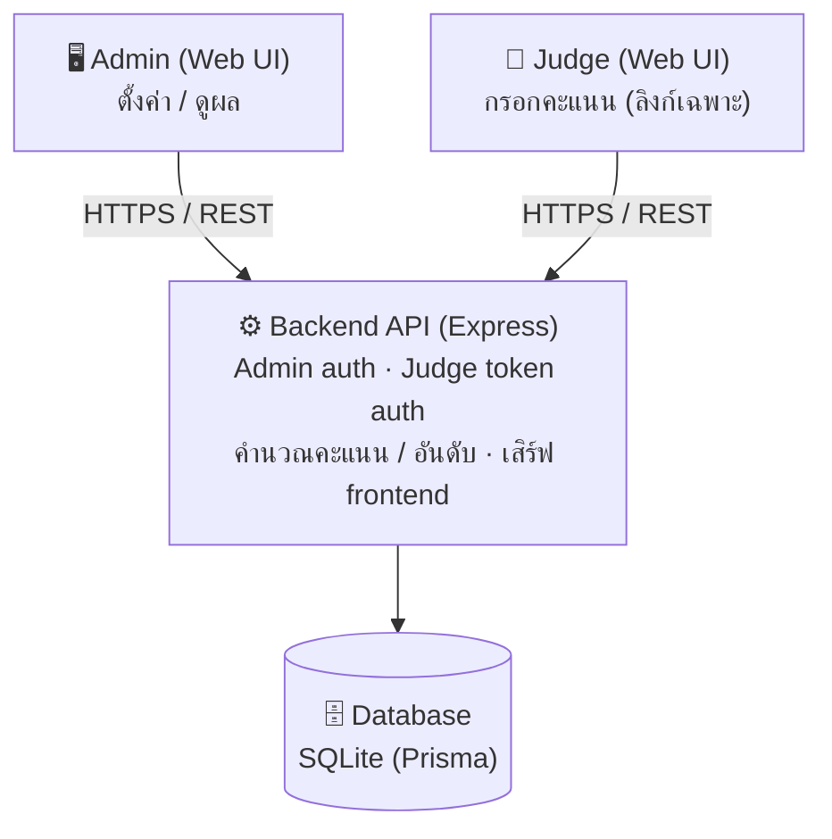
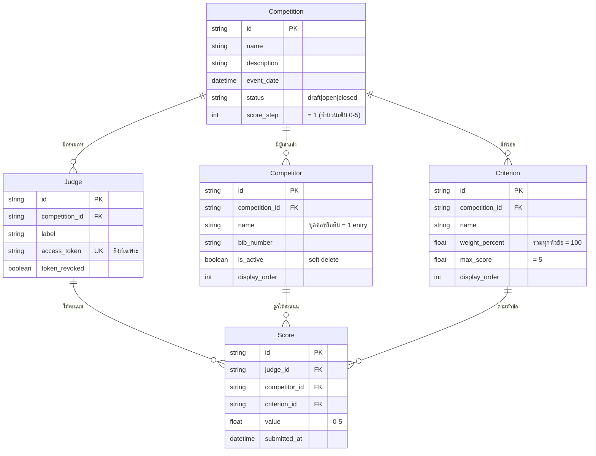
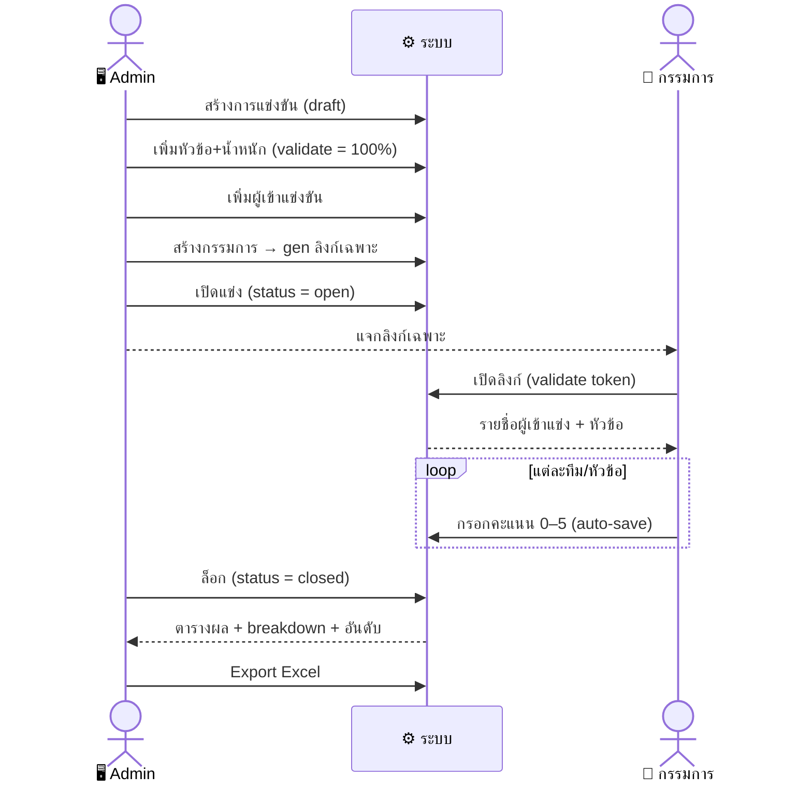

# Design — โปรแกรมให้คะแนนการแข่งขัน (score-app)

> เอกสารฉบับร่าง v0.1 — 2026-09-29
> อ้างอิง: `01-requirements.md`

## 1. 🏗️ สถาปัตยกรรมภาพรวม



หลักการออกแบบ (เน้นฟรี + ย้ายง่าย):
- ทั้งระบบแพ็กเป็น **Docker image เดียว** (backend เสิร์ฟ API + frontend static) → ยกไปรันที่ไหนก็ได้
- ฐานข้อมูลใช้ **SQLite** (ผ่าน Prisma) — เล็ก พกพาง่าย เพียงพอสำหรับโหลดต่ำ (< 10 users, ≤ 20 ทีม); สลับไป PostgreSQL ได้โดยเปลี่ยน provider
- ไม่พึ่ง managed service เฉพาะเจ้า → ย้ายค่าย/ย้ายเครื่องไม่ต้องแก้โค้ด

> **หมายเหตุ deploy จริง (v0.2.0):** deploy บน Azure Container Apps โดย SQLite เก็บบน Azure Files (mount `nobrl`)
> ดังนั้นต้องจำกัด **1 replica** (SQLite+SMB รองรับตัวเขียนเดียว) — รายละเอียดใน `05-deployment.md`

## 2. 🗂️ Data Model (ER)



> [!NOTE]
> - `Score` มี **unique constraint** `(judge_id, competitor_id, criterion_id)` กันคะแนนซ้ำ
> - `AdminUser` (username/password_hash) อยู่ใน spec แต่ **ยังไม่ได้ทำ** ใน v0.2.0 (หน้า Admin ยังไม่มี login)

> [!NOTE]
> **โมเดลที่เพิ่มหลัง v0.2.0** (รายละเอียดใน [`06-design-log-and-scorelock.md`](06-design-log-and-scorelock.md)):
> - `ActivityLog` — บันทึกการใช้งาน (v0.4.0)
> - `Judge.scoresLockedAt` — ยืนยัน/ล็อกคะแนนทั้งชุดของกรรมการ (v0.4.0)
> - `TeamLock` — ล็อกคะแนนรายทีมต่อกรรมการ กันกดผิด (v0.5.0)

## 3. สูตรการคำนวณคะแนน

กำหนดให้ในการแข่งขันหนึ่ง:
- หัวข้อ (criteria) มี `k` หัวข้อ แต่ละหัวข้อ `c` มีน้ำหนัก `w_c` (%) โดย Σ w_c = 100
- คะแนนเต็มต่อหัวข้อ = 5

### 3.1 คะแนนของกรรมการ j ต่อผู้เข้าแข่งขัน i (เต็ม 5)

```
judgeScore(i, j) = Σ_c [ score(i, j, c) × (w_c / 100) ]
```

เนื่องจากคะแนนแต่ละหัวข้อเต็ม 5 และ Σ (w_c/100) = 1
→ ผลลัพธ์อยู่ในช่วง 0..5 โดยอัตโนมัติ

**ตัวอย่าง:** หัวข้อ A(20%) B(20%) C(30%) D(30%)
กรรมการให้ A=4, B=5, C=3, D=4
```
= 4×0.20 + 5×0.20 + 3×0.30 + 4×0.30
= 0.80 + 1.00 + 0.90 + 1.20
= 3.90  (เต็ม 5)
```

### 3.2 คะแนนสุดท้ายของผู้เข้าแข่งขัน i (เต็ม 5)

เฉลี่ยจากกรรมการทั้งหมด `m` คน:
```
finalScore(i) = ( Σ_j judgeScore(i, j) ) / m
```

> หมายเหตุ: เวอร์ชันแรกใช้เฉลี่ยธรรมดา (ไม่ตัดสูง-ต่ำ) — สามารถเพิ่มโหมด trimmed mean ภายหลัง

### 3.3 การจัดอันดับและ tie-break

- เรียงจาก `finalScore` มาก → น้อย
- **Tie-break (รอยืนยัน user จริง):** ถ้า finalScore เท่ากัน เทียบคะแนนเฉลี่ยในหัวข้อที่น้ำหนักสูงสุดก่อน ถ้ายังเท่าให้ครองอันดับร่วม (rank เดียวกัน) — แนวทางนี้เจ้าของโปรเจกต์จะนำไปยืนยันกับ user จริงอีกครั้ง

## 4. API Endpoints (ร่าง)

### 4.1 Admin (ต้อง auth ด้วย admin session/JWT)
```
POST   /api/admin/login
POST   /api/competitions                     สร้างการแข่งขัน
GET    /api/competitions/:id                  ดูรายละเอียด
PATCH  /api/competitions/:id                  แก้ไข / เปลี่ยน status
POST   /api/competitions/:id/criteria         เพิ่มหัวข้อ (validate Σweight=100)
PATCH  /api/criteria/:id                       แก้หัวข้อ/น้ำหนัก
DELETE /api/criteria/:id

POST   /api/competitions/:id/competitors      เพิ่มผู้เข้าแข่งขัน
PATCH  /api/competitors/:id                    แก้ไข
DELETE /api/competitors/:id                    (soft delete / is_active=false)

POST   /api/competitions/:id/judges           สร้างกรรมการ + สร้าง access_token
POST   /api/judges/:id/revoke-token            เพิกถอน/สร้าง token ใหม่
GET    /api/judges/:id/link                     ดึงลิงก์เฉพาะของกรรมการ

GET    /api/admin/competitions/:id/results     ผลรวม + breakdown ต่อกรรมการ/หัวข้อ + อันดับ
GET    /api/admin/competitions/:id/export       Export เป็น Excel (.xlsx)   *(ทำแล้ว v0.2.0)*
POST   /api/admin/competitions/import           Import Excel -> สร้างการแข่งขันใหม่ (body = ไฟล์ .xlsx raw)  *(ทำแล้ว v0.2.0)*
DELETE /api/admin/competitions/:id              ลบการแข่งขัน (409 ถ้ายังไม่ closed)  *(ทำแล้ว v0.2.0)*
DELETE /api/admin/judges/:id                    ลบกรรมการ  *(ทำแล้ว v0.2.0)*
GET    /api/version                             เลขเวอร์ชันแอป  *(ทำแล้ว v0.2.0)*
```

> **หมายเหตุสถานะจริง (v0.2.0):**
> - endpoint จริงมี prefix `/api/admin/...` (เช่น `/api/admin/competitions`)
> - **ยังไม่ได้ทำ:** `/admin/login` + JWT auth (หน้า Admin ยังไม่มีระบบ login), `/progress`, export PDF/CSV, tie-break (ใช้เฉลี่ยธรรมดา + อันดับร่วมเมื่อคะแนนเท่ากัน)
> - **ทำแล้วหลัง v0.2.0:** แก้ไขชื่อหัวข้อ/ผู้เข้าแข่ง/กรรมการ (PATCH, v0.3.0), Activity Log + ยืนยัน-ล็อกคะแนนทั้งชุด (v0.4.0), ล็อกคะแนนรายทีม (v0.5.0) — ดู [`06-design-log-and-scorelock.md`](06-design-log-and-scorelock.md)
> - competitor delete = soft delete (is_active=false); judge/criteria/competition delete = ลบจริง (cascade)

### 4.2 Judge (auth ด้วย access_token ในลิงก์)
```
GET    /api/judge/session?token=...            ตรวจ token + คืนข้อมูลการแข่งขัน + รายชื่อผู้เข้าแข่ง
GET    /api/judge/scores?token=...             คืนเฉพาะคะแนน "ของตัวเอง" เท่านั้น
PUT    /api/judge/scores?token=...             บันทึก/แก้คะแนน (auto-save รายหัวข้อ)
```

**การบังคับความเป็นส่วนตัว (NFR-1):**
- Endpoint ฝั่ง judge จะ filter ด้วย `judge_id` ที่ผูกกับ token เสมอ → ไม่มีทางดึงคะแนนคนอื่น
- ไม่มี endpoint ฝั่ง judge ที่คืนคะแนนรวม/อันดับ

## 5. Flow การใช้งาน
## 5. 🔄 Flow การใช้งาน



### 5.1 Admin ตั้งค่า
1. Login → สร้างการแข่งขัน (status=draft)
2. เพิ่มหัวข้อ + น้ำหนัก (ระบบ validate รวม = 100%)
3. เพิ่มผู้เข้าแข่งขัน (เพิ่ม/ลดได้ตลอด)
4. สร้างกรรมการ → ระบบ gen ลิงก์เฉพาะ → Admin ก๊อปแจก
5. เปลี่ยน status = open

### 5.2 Judge กรอกคะแนน
1. เปิดลิงก์เฉพาะของตน → ระบบ validate token
2. เห็นรายชื่อผู้เข้าแข่งขัน + สถานะของตัวเอง
3. กรอกคะแนนแต่ละหัวข้อ (0–5) → auto-save
4. แก้ไขได้จนกว่าจะ closed

### 5.3 Admin รวมผล
1. ตรวจ progress ว่ากรรมการครบไหม
2. เปลี่ยน status = closed
3. ดูตารางผล (breakdown + อันดับ) → export

## 6. ความปลอดภัยและความถูกต้อง

- **Token กรรมการ:** สุ่ม ≥ 32 ตัวอักษร (crypto-random), unique, เพิกถอนได้
- **Validation:** คะแนนกรรมการเป็นจำนวนเต็ม ∈ [0, 5]; น้ำหนักรวม = 100% เป๊ะ ก่อนเปิดแข่ง
- **Concurrency:** unique constraint (judge, competitor, criterion) + upsert กันข้อมูลชน
- **Audit:** เก็บ submitted_at / updated_at ของทุกคะแนน
