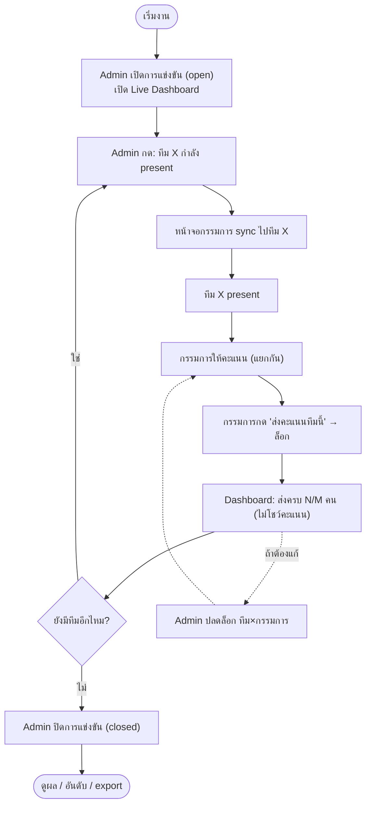
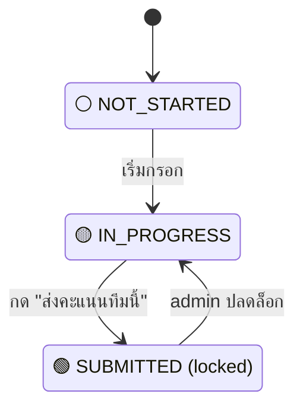

# Live Presentation Workflow & Admin Dashboard — score-app

> เอกสารฉบับร่าง v0.1 — 2026-09-29
> อ้างอิง: `01-requirements.md`, `02-design.md`
> บริบท: การแข่งขันแบบ **present สดหน้างาน** — แต่ละทีมขึ้น present ทีละทีม กรรมการให้คะแนนสดแล้วนำมารวม

> [!IMPORTANT]
> เอกสารนี้เป็น **แผนอนาคต (ยังไม่ได้ทำใน v0.2.0)** — Live Dashboard / WebSocket / การล็อกทีละทีม ยังไม่ถูก implement
> เวอร์ชันปัจจุบันใช้ Lock/Unlock ทั้งการแข่งขัน (ดู `01-requirements.md`)

## 1. 🗺️ ภาพรวมหน้างาน (Event Flow)



## 2. บทบาทและมุมมอง

### 2.1 Admin — Live Dashboard (จอคุมงาน)
สิ่งที่ **เห็น** ระหว่างแข่ง:
- **แถบควบคุมคิว:** ทีมที่กำลัง present + ปุ่ม "ทีมก่อนหน้า / ทีมถัดไป" + เลือกทีมจากรายการ
- **ตารางสถานะ กรรมการ × ทีม:**

  | ทีม \ กรรมการ | ก.1 | ก.2 | ก.3 | ก.4 | ก.5 | สรุป |
  |---------------|-----|-----|-----|-----|-----|------|
  | ทีม A         | 🟢  | 🟢  | 🟢  | 🟢  | 🟢  | 5/5 ✓ |
  | ทีม B (▶ now) | 🟢  | 🟢  | 🟡  | ⚪  | 🟢  | 3/5  |
  | ทีม C         | ⚪  | ⚪  | ⚪  | ⚪  | ⚪  | 0/5  |

  - 🟢 = ส่งครบ (locked) · 🟡 = กรอกบางส่วน · ⚪ = ยังไม่เริ่ม
- **ตัวนับต่อทีมที่ present อยู่:** "ส่งครบแล้ว 3/5 คน — รอ กรรมการ 4"
- ปุ่ม **ปลดล็อก** ราย (ทีม×กรรมการ) เพื่อให้แก้
- ปุ่ม **ปิดการแข่งขัน**

สิ่งที่ **ไม่เห็น** ระหว่างแข่ง:
- ❌ ตัวเลขคะแนน / คะแนนรวม / อันดับ (กันดราม่า/กันกดดันกรรมการหน้างาน)
  > ยกเว้น admin กดเมนู "ดูผลตอนนี้" โดยเจตนา (มี confirm) — ค่าเริ่มต้นซ่อนไว้

### 2.2 Judge — หน้ากรอกคะแนน (มือถือ/แท็บเล็ต)
- แสดง **ทีมที่กำลัง present** เด่นชัด (sync ตามที่ admin กด)
- ฟอร์มคะแนนตามหัวข้อ (จำนวนเต็ม 0–5) + auto-save ระหว่างพิมพ์
- ปุ่ม **"ส่งคะแนนทีมนี้"** → ล็อก (แก้ไม่ได้จนกว่า admin ปลดล็อก)
- เห็นเฉพาะสถานะ **ของตัวเอง** ว่าทีมไหนส่งแล้ว/ยัง — ไม่เห็นของคนอื่น ไม่เห็นคะแนนรวม

## 3. 🚦 สถานะการส่งคะแนน (State per Judge × Competitor)



- **NOT_STARTED (⚪):** ยังไม่มีคะแนนหัวข้อใดเลย
- **IN_PROGRESS (🟡):** มีคะแนนบางส่วน ยังไม่กดส่ง (auto-save ไว้แล้ว)
- **SUBMITTED (🟢):** กดส่งแล้ว ล็อก — ใช้เป็นตัวนับความครบถ้วน
- admin ปลดล็อก → กลับเป็น IN_PROGRESS ให้แก้

## 4. Data Model — ส่วนที่เพิ่มจาก 02-design.md

```
Competition (เพิ่มฟิลด์)
  current_competitor_id   -- ทีมที่กำลัง present อยู่ (admin ควบคุม); null = ยังไม่เริ่ม/พัก

Submission (สถานะการส่งคะแนน)  -- 1 ค่า ต่อ (Judge × Competitor)
  id (PK)
  judge_id (FK)
  competitor_id (FK)
  status               -- NOT_STARTED | IN_PROGRESS | SUBMITTED
  submitted_at         -- เวลาเมื่อกดส่ง (null ถ้ายังไม่ส่ง)
  unlocked_by_admin_at -- เวลาที่ admin ปลดล็อกล่าสุด (audit)
  UNIQUE(judge_id, competitor_id)
```

> คะแนนรายหัวข้อยังเก็บในตาราง `Score` เหมือนเดิม; `Submission` คุมสถานะ/ล็อกในระดับทีม-ต่อ-กรรมการ

## 5. Real-time (WebSocket)

- ใช้ WebSocket ให้ **Admin Dashboard อัปเดตสด** เมื่อกรรมการเปลี่ยนสถานะ
- Event หลัก:
  - `competition:current-changed` — admin เปลี่ยนทีมที่ present → broadcast ให้กรรมการทุกคน sync
  - `submission:updated` — กรรมการเริ่มกรอก/กดส่ง → ส่งให้ admin (สถานะ/สี เท่านั้น ไม่ส่งคะแนน)
  - `submission:unlocked` — admin ปลดล็อก → แจ้งกรรมการที่เกี่ยวข้อง
- **ความปลอดภัย:** payload ที่ส่งถึงฝั่งกรรมการ/dashboard มีแค่สถานะ (status/สี/ตัวนับ) — **ไม่มีค่าคะแนน** เพื่อคง NFR-1

## 6. API เพิ่มเติม (ต่อจาก 02-design.md §4)

### Admin
```
PATCH  /api/competitions/:id/current-competitor   { competitorId }  ตั้งทีมที่ present
POST   /api/submissions/:id/unlock                 ปลดล็อกให้กรรมการแก้
GET    /api/competitions/:id/live                  สถานะสด (กรรมการ×ทีม, สี, ตัวนับ) — ไม่มีคะแนน
```

### Judge
```
POST   /api/judge/submit?token=...    { competitorId }   กดส่ง+ล็อกคะแนนทีมนี้ของตน
GET    /api/judge/current?token=...                      ทีมที่กำลัง present ตอนนี้
```

## 7. การตั้งค่าที่ปรับได้ (เผื่อ user จริงอยากเปลี่ยน)

- **โหมดคุมคิว:** `admin-controlled` (แนะนำ) หรือ `judge-free` (กรรมการเลือกทีมเองจากรายการ)
- **การล็อกหลังส่ง:** `lock-on-submit` (แนะนำ) หรือ `always-editable` (แก้ได้ตลอดจนปิดแข่ง)
- **admin ดูคะแนนระหว่างแข่ง:** default `hidden` — เปิดได้เฉพาะกดยืนยัน
- **real-time:** default WebSocket; fallback auto-refresh ทุก ~5 วิ ถ้าเชื่อมไม่ได้

## 8. จุดที่รอ user จริงยืนยัน (Open)

- **LQ-1** จังหวะล็อก: ล็อกทันทีเมื่อกด "ส่งคะแนนทีมนี้" ใช่ไหม (ค่าเริ่มต้นที่ออกแบบไว้)
- **LQ-2** admin คุมคิวให้กรรมการ sync ทีม vs. ปล่อยกรรมการเลือกเอง — ออกแบบไว้เป็น admin คุมคิว
- **LQ-3** ต้องมี "หน้าจอประกาศผล/จอใหญ่" ตอนจบไหม (ตอนนี้อยู่ใน out-of-scope เฟสแรก)
- **LQ-4** ถ้าเพิ่มทีมกลางคัน ทีมใหม่จะไปต่อท้ายคิวอัตโนมัติ — โอเคไหม
