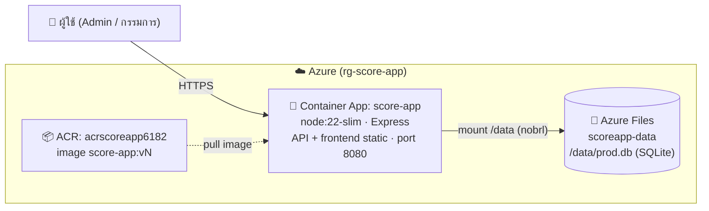

# Deployment — score-app บน Azure Container Apps

> อัปเดต: 2026-09-30 (v0.5.0 · image score-app:v12)
> เอกสารนี้บันทึกสถาปัตยกรรม deploy จริง, ชื่อ resource, ขั้นตอน redeploy และข้อจำกัด/บทเรียน

## 1. ภาพรวม

แอปถูกแพ็กเป็น **Docker image เดียว** (backend เสิร์ฟทั้ง API และ frontend static) แล้ว deploy บน
**Azure Container Apps (ACA)** โดยข้อมูล SQLite เก็บบน **Azure Files** (persistent) — ข้อมูลไม่หายแม้ scale-to-zero



## 2. Azure Resources (ทั้งหมดอยู่ใน Resource Group เดียว)

| ประเภท | ชื่อ | หมายเหตุ |
|--------|------|----------|
| Resource Group | `rg-score-app` | region: southeastasia |
| Container Registry (ACR) | `acrscoreapp6182` | SKU Basic, admin enabled; เก็บ image `score-app:vN` |
| Container Apps Environment | `score-app-env` | |
| Container App | `score-app` | ingress external, target port 8080 |
| Storage Account | `stscoreapp8164` | Standard_LRS |
| File Share | `scoreapp-data` | เก็บไฟล์ `prod.db` |
| Env storage (ผูกกับ environment) | `scoreappfiles` | ชี้ไป file share ข้างบน |

> FQDN ปัจจุบัน: `https://score-app.jollyrock-fc32fd20.southeastasia.azurecontainerapps.io`
> (ส่วน `jollyrock-...` Azure สุ่มให้ตอนสร้าง environment — ถ้าสร้างใหม่จะเปลี่ยน)

## 3. การตั้งค่าสำคัญ

- **DATABASE_URL** = `file:/data/prod.db` (ตั้งใน Dockerfile) — SQLite บน Azure Files ที่ mount `/data`
- **PORT** = 8080, **NODE_ENV** = production
- **Volume mount:** volume `data` (Azure File `scoreappfiles`) → mountPath `/data`
- **mountOptions:** `dir_mode=0777,file_mode=0777,mfsymlinks,nobrl` — **`nobrl` สำคัญมาก** (ดู §6)
- **Scale:** `minReplicas=0` (scale-to-zero ประหยัด), `maxReplicas=1` (ต้องเป็น 1 — ดู §6)
- ตอน container start: `prisma migrate deploy && node dist/seed.js && node dist/index.js`
  - `seed.js` เป็น idempotent — seed เฉพาะตอน DB ว่าง

## 4. ขั้นตอน Redeploy (เมื่อแก้โค้ดแล้ว)

ต้องมี: `az` CLI (login แล้ว), extension `containerapp`

```powershell
# 0) แนะนำตั้ง console เป็น UTF-8 กัน az CLI crash ตอน stream log (Windows)
chcp 65001
$env:PYTHONIOENCODING="utf-8"; $env:PYTHONUTF8="1"

# 1) build image ใหม่บน ACR (เพิ่มเลขเวอร์ชัน vN) — ใช้ --no-logs เลี่ยง unicode crash
az acr build --registry acrscoreapp6182 --image score-app:v13 --no-logs .

# 2) อัปเดต image โดยตรง (ไม่ต้องแตะ app.yaml — volume/mount เดิมคงอยู่)
az containerapp update --name score-app --resource-group rg-score-app `
  --image acrscoreapp6182.azurecr.io/score-app:v13

# 3) smoke test
#   https://<fqdn>/api/health   -> {"ok":true}
#   https://<fqdn>/api/version  -> {"version":"x.y.z"}
#   https://<fqdn>/admin        -> หน้าเว็บโหลด
```

> 💡 ตั้งแต่ v6 เป็นต้นมาใช้ `az containerapp update --image ...` โดยตรง (ไม่ต้อง export/แก้ `app.yaml`)
> วิธีนี้ไม่แตะ volume/mountOptions ที่ตั้งไว้แล้ว จึงปลอดภัยกว่า — ใช้ `--yaml app.yaml` เฉพาะเมื่อต้องแก้ config โครงสร้าง
> ถ้ามี migration ใหม่ (Prisma) จะถูก apply อัตโนมัติตอน container start (`prisma migrate deploy` ใน Dockerfile CMD)

> `app.yaml` = ไฟล์ config ของ container app (export ด้วย `az containerapp show ... -o yaml`)
> ถูก gitignore ไว้ (มีข้อมูลเฉพาะ environment) — ถ้าหาย export ใหม่ได้ แล้วเติม volume/mountOptions ตาม §3

## 5. First-time Setup (ถ้าต้องสร้างใหม่ทั้งหมด)

```powershell
az group create --name rg-score-app --location southeastasia
az acr create --name <acrname> --resource-group rg-score-app --sku Basic --admin-enabled true
az storage account create --name <saname> --resource-group rg-score-app --location southeastasia --sku Standard_LRS
$key = az storage account keys list --account-name <saname> --resource-group rg-score-app --query "[0].value" -o tsv
az storage share create --name scoreapp-data --account-name <saname> --account-key $key
az containerapp env create --name score-app-env --resource-group rg-score-app --location southeastasia
az containerapp env storage set --name score-app-env --resource-group rg-score-app `
  --storage-name scoreappfiles --azure-file-account-name <saname> --azure-file-account-key $key `
  --azure-file-share-name scoreapp-data --access-mode ReadWrite
az acr build --registry <acrname> --image score-app:v1 --no-logs .
# สร้าง container app จาก image + ACR credential + ingress 8080
# แล้ว update ด้วย app.yaml ที่มี volume mount /data + mountOptions nobrl
```

## 6. ⚠️ ข้อจำกัดและบทเรียน (สำคัญ — อ่านก่อนแก้)

### 6.1 SQLite + Azure Files → ต้องใช้ `nobrl`

> [!WARNING]
> Azure Files เป็น SMB share ซึ่ง **ไม่รองรับ byte-range lock** ที่ SQLite ใช้ → เจอ error `database is locked`
> **แก้:** mount option **`nobrl`** (ปิด byte-range lock)
> **ผลข้างเคียง:** ปลอดภัยเฉพาะเมื่อมี **ตัวเขียน DB ตัวเดียว** → ต้องล็อก **`maxReplicas=1`**
> ห้ามเพิ่ม replica เกิน 1 (เสี่ยง data corruption)
- เหมาะกับโหลดต่ำ (กรรมการ+admin < 10, ทีม ≤ 20) ซึ่งตรงกับ use case จริง
- ถ้าต้องการหลาย replica / โหลดสูง → ต้องย้ายไป PostgreSQL (มีค่าใช้จ่าย)

### 6.2 Prisma engine platform
- Prisma query engine เป็น binary ผูกกับ OS — build บน Windows (native) แต่รันบน Linux container
- ต้องระบุใน `schema.prisma`: `binaryTargets = ["native", "debian-openssl-3.0.x"]`
  (`node:22-slim` = Debian OpenSSL 3.0.x); ถ้าไม่ใส่ container จะ crash ตอน query

### 6.3 az CLI + Windows console (UnicodeEncodeError)
- `az acr build` / `az containerapp up` พยายาม print unicode (`✓`) ลง console cp1252 แล้ว crash
- แก้: `chcp 65001` + `PYTHONIOENCODING=utf-8` + `PYTHONUTF8=1` และใช้ `az acr build --no-logs`

### 6.4 az containerapp up (cloud build) ใช้ไม่ได้บน Windows
- crash เรื่อง encoding + ManagedEnvironmentNotFound → เลี่ยงไปใช้ `az acr build` แล้ว deploy จาก image แทน

### 6.5 Database เป็น ephemeral ไหม?

> [!TIP]
> **ไม่** — ข้อมูลอยู่บน Azure Files (persistent) แม้ scale-to-zero หรือ container restart ข้อมูลคงอยู่
> แต่ scale-from-zero (ครั้งแรกหลังไม่มีทราฟฟิกนาน) จะรอ container start ~10–30 วิ

## 7. ค่าใช้จ่าย

- Subscription: Visual Studio Enterprise (มีเครดิตรายเดือน)
- ACA scale-to-zero + ACR Basic + Azure Files (ข้อมูลไม่กี่ MB) → ต่ำมากสำหรับ demo/งานเล็ก
- ประเมินจริง/ตั้ง budget alert ที่ [Azure Cost Management](https://portal.azure.com) และ [Pricing Calculator](https://azure.microsoft.com/pricing/calculator/)

## 8. Operational Notes

- **Redeploy ระหว่างงาน:** เลี่ยง deploy ตอนกรรมการกำลังกรอกคะแนน (revision เก่า/ใหม่รันซ้อนช่วงเปลี่ยน)
- **ลิงก์กรรมการหลัง re-seed/import:** เปลี่ยนใหม่ ต้องแจกใหม่ (เข้า /admin → เลือกการแข่งขัน → แสดงลิงก์)
- **backup ข้อมูล:** ใช้ปุ่ม Export Excel ต่อการแข่งขัน; หรือดึงไฟล์ `prod.db` จาก file share `scoreapp-data`


## 9. CI/CD (GitHub Actions)

แยกเป็น 2 workflow:

| ไฟล์ | บทบาท | trigger |
|------|-------|---------|
| `.github/workflows/ci.yml` | **CI** — build/typecheck ทั้ง frontend + backend + `prisma validate` | ทุก push/PR เข้า `main` |
| `.github/workflows/deploy.yml` | **CD** — `az acr build` + `az containerapp update` + smoke test | push tag `v*` หรือกดรันเอง (workflow_dispatch) |

### 9.1 Flow ปกติ
1. push โค้ดเข้า `main` → **CI** รัน (จับ error เร็ว ไม่ deploy)
2. ออก release: `git tag vX.Y.Z && git push --tags` → **CD** build image `score-app:vX.Y.Z` แล้ว deploy ACA อัตโนมัติ
3. CD ทำ smoke test `/api/health` + `/api/version` ถ้าไม่ผ่าน job จะ fail

> deploy ผูกกับ **tag** (ตั้งใจ release) ไม่ใช่ทุก push — กัน deploy ระหว่างกรรมการกรอกคะแนน (ดู §8)

### 9.2 Setup ครั้งเดียว — Azure credentials เป็น GitHub Secret

สร้าง Service Principal (แนะนำแทน admin credential ของ ACR) แล้วเก็บเป็น secret `AZURE_CREDENTIALS`:

```powershell
# 1) สร้าง SP ที่มีสิทธิ์ Contributor เฉพาะ resource group นี้ (ขอบเขตแคบ)
az ad sp create-for-rbac `
  --name "score-app-gh-actions" `
  --role Contributor `
  --scopes /subscriptions/<SUB_ID>/resourceGroups/rg-score-app `
  --sdk-auth
# คัดลอก JSON ที่ได้ทั้งก้อน

# 2) GitHub repo → Settings → Secrets and variables → Actions → New repository secret
#    Name  = AZURE_CREDENTIALS
#    Value = JSON จากขั้นตอน 1
```

> `--sdk-auth` ให้ JSON รูปแบบที่ `azure/login@v2` ใช้ได้ทันที
> SP ต้องมีสิทธิ์ push ไป ACR ด้วย — Contributor บน resource group ครอบคลุมทั้ง ACR build และ container app update ใน RG นี้แล้ว

### 9.3 ค่าคงที่ใน workflow
`deploy.yml` hardcode ค่า resource (ไม่ลับ) ไว้ใน `env:` — ถ้าเปลี่ยน resource/FQDN ต้องแก้ตรงนั้น:
`ACR_NAME`, `RESOURCE_GROUP`, `CONTAINERAPP_NAME`, `IMAGE_REPO`, `FQDN`
